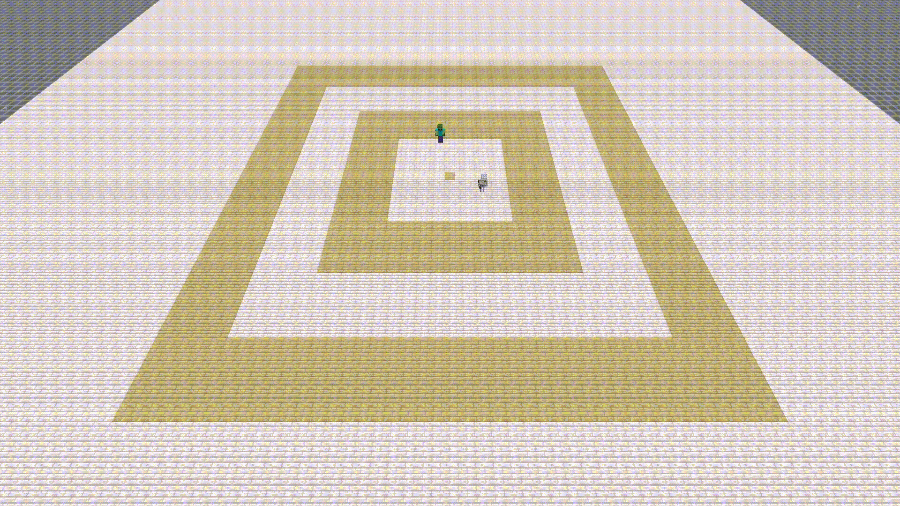
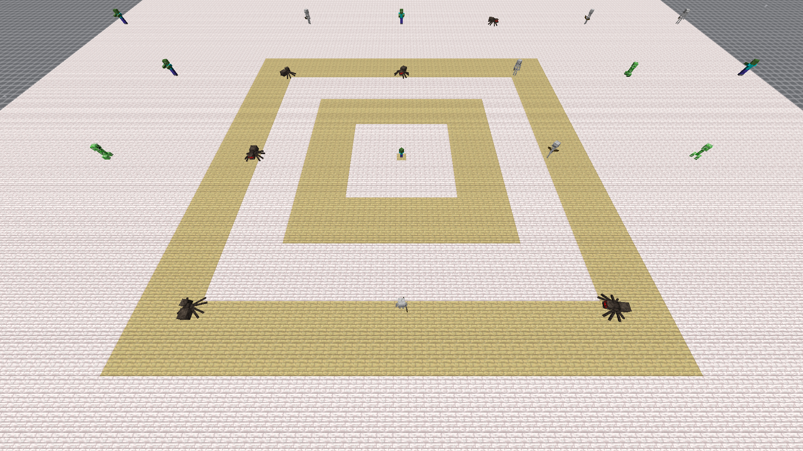
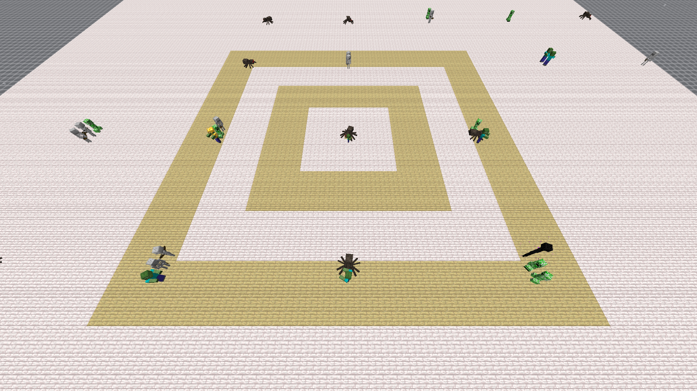
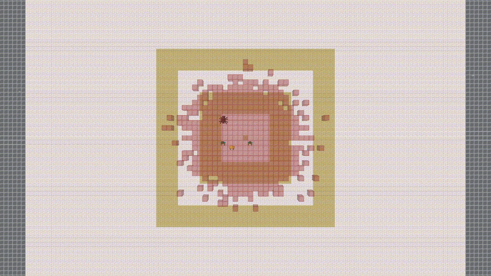
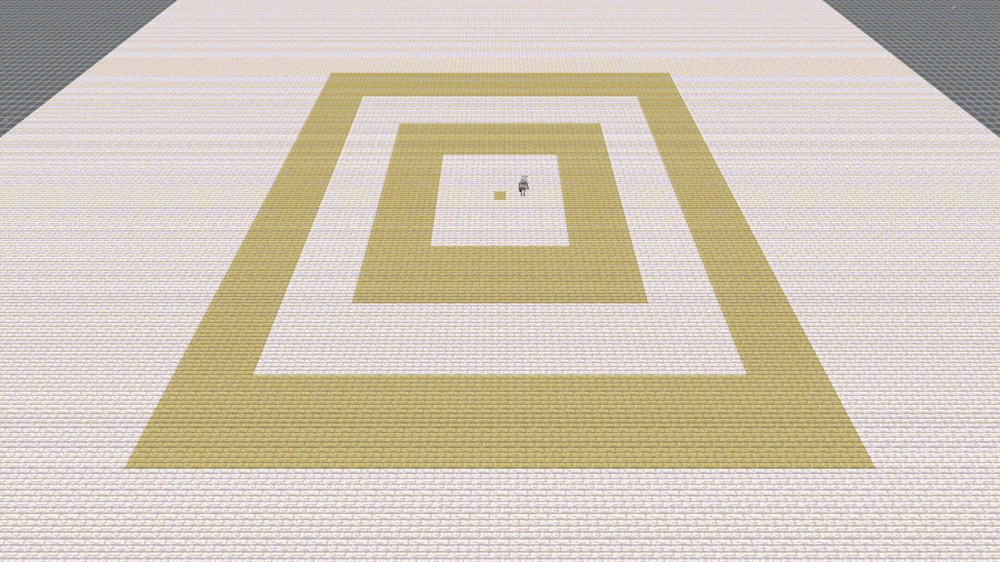

# Spawn Forcer

Ad-hoc mod to help test pack spawning.

Requires 1.21.5 carpet mod available [here](https://masa.dy.fi/maven/carpet/fabric-carpet/1.21.5-1.4.169%2Bv250325/) (the .jar file) at the time of writing this.

## Rules

### Starting Coordinate Per Dimension

#### `/spawnforcer fixedStart {true, false}`

Force spawning to start at the coordinate specified by `startCoords`.  
If `startCoords` is not defined, it will default to (0,0,0).  
This rule takes precedence over `fixedInChunk` and `fixedBottomY`.  
Defaults to false.

#### `/spawnforcer startCoords {x} {y} {z}`

Sets the starting position for the spawn attempts to (x,y,z) when `fixedStart` is enabled.

 - Example with `fixedStart true` and `startCoords 0 -63 0`:

### Starting Coordinate Per Chunk

#### `/spawnforcer fixedInChunk {true, false}`

Force spawning to a fixed x and z chunk coordinate specified by `chunkStartX` and `chunkStartZ`.  
The `fixedStart` option takes precedence over this rule.  
Defaults to false.

- Example with `fixedInChunk true`:

#### `/spawnforcer fixedBottomY {true, false}`

Force spawning to sample from y value between `chunkBottomY` and heightmap + 1 instead of the world bottom to heightmap + 1.  
The `fixedStart` option takes precedence over this rule.  
Defaults to false.

#### `/spawnforcer chunkStartX {x}`

Sets the starting position to the specified chunk coordinate in the x axis when `fixedInChunk` is enabled.  
Defaults to 0.

#### `/spawnforcer chunkStartZ {z}`

Sets the starting position to the specified chunk coordinate in the z axis when `fixedInChunk` is enabled.  
Defaults to 0.

#### `/spawnforcer chunkBottomY {y}`

Sets the bottom y to the specified level instead of the world bottom when `fixedBottomY` is enabled.  
Defaults to 0.

### Starting Coordinate

#### `/spawnforcer startSpreadX {n}`

Adds a random amount to the x coordinate of the starting spawn position, the amount will be uniformly distributed between -n and n (inclusive).  
This option works with either `fixedStart` or `fixedInChunk`.  
Defaults to 0.

#### `/spawnforcer startSpreadZ {n}`

Adds a random amount to the z coordinate of the starting spawn position, the amount will be uniformly distributed between -n and n (inclusive).  
This option works with either `fixedStart` or `fixedInChunk`.  
Defaults to 0.

- Example with `fixedInChunk true` and `startSpreadZ 1`:

### Pack Spawning Jumps

- Example default spread:

#### `/spawnforcer uniformJump {true, false}`

Change each x and z jump to be uniformly distributed between -5 and 5 (inclusive).  
The `spreadJump` rule takes precedence over this rule.  
The `jumpSequenceX` rule takes precedence over the x component of this rule.  
The `jumpSequenceZ` rule takes precedence over the z component of this rule.  
Defaults to false.

#### `/spawnforcer spreadJump {true, false}`

Change each x and z jump to heavily favour values closer to -5 and 5.  
This rule overrides `uniformJump` rule.  
The `jumpSequenceX` rule takes precedence over the x component of this rule.  
The `jumpSequenceZ` rule takes precedence over the z component of this rule.  
Defualts to false.

#### `/spawnforcer jumpSequenceX {n1...}`

Force each x jump within a pack to follow the given sequence.  
If the pack size is greater than the length of the sequence, the last number in the sequence will be repeated.  
This rule takes precedence over the x component of `uniformJump` and `spreadJump`.  
Defaults to nothing (empty string `""`).

#### `/spawnforcer jumpSequenceZ {n1...}`

Force each z jump within a pack to follow the given sequence.  
If the pack size is greater than the length of the sequence, the last number in the sequence will be repeated.  
This rule takes precedence over the z component of `uniformJump` and `spreadJump`.  
Defaults to nothing (empty string `""`).

- Example with `fixedStart true`, `startCoords 0 -63 0`, `jumpSequenceZ 0`, `jumpSequenceX 1 1 1 5`:

### Misc.

#### `/spawnforcer allowNear {true, false}`

Allows spawning within 24 blocks of the players and the world spawn point.  
Defaults to false.

#### `/spawnforcer noStartOnGildedBlackstone {true, false}`

Disable starting position that is directly on top of a gilded blackstone.  
Defaults to false.

This option is mainly to allow *spawning* on the platform, but disallow *starting* on the platform
for pack-spawning testing purposes.
